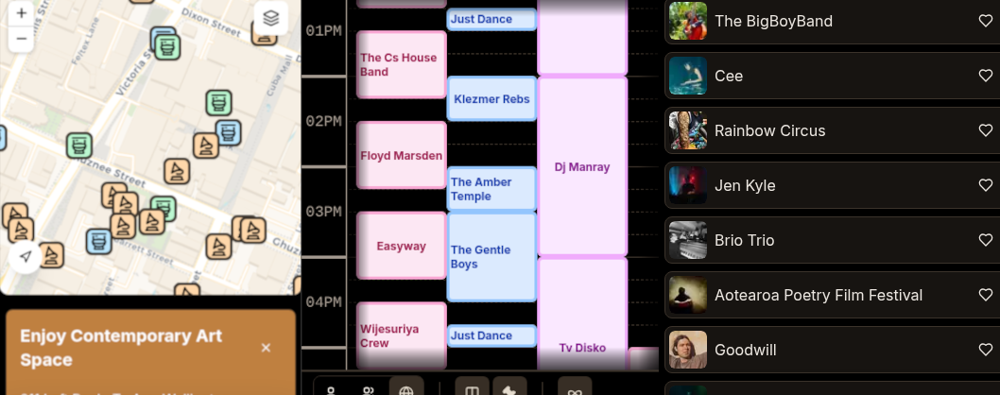

# Ariadne

A high-performance, offline-first Progressive Web Application (PWA) designed to help attendees enjoy, plan, and navigate the labyrinth that can be festivals. 

I built a rudimentary version of this application last year, I have trouble navigating in crowds and can get bogged down at festivals and other events; I end staying at one or two locations instead of experiencing all I had meant to. This application is a start to help that, it allows me to always find my way and is named so for the hero that helped Theseus by laying down string so he could escape the Minotaur. 

Have a look here: https://ariadne-festival.vercel.app

## Purpose

This application provides a dynamic, interactive solution for:
*   **Dynamic Planning:** Build a personalized schedule from a massive lineup.
*   **Seamless Navigation:** Real-time GPS positioning to find venue locations.
*   **Social Coordination:** Share personalized "must-see" lists via QR codes.

---

---
## Technical Stack

### Core Framework & UI
*   **Framework:** [Next.js 15+](https://nextjs.org/) (App Router)
*   **Language:** TypeScript
*   **Styling:** [Tailwind CSS](https://tailwindcss.com/) + [Shadcn UI](https://ui.shadcn.com/)
*   **Animations:** [Framer Motion](https://www.framer.com/motion/) (for liquid UI transitions and smooth interactions)
*   **Icons:** Lucide React

### Offline & PWA Capabilities
*   **Service Worker Management:** [Serwist](https://serwist.js.org/) (the successor to Workbox for Next.js)
*   **Local Storage:** IndexedDB (via `idb-keyval`) for persisting map tiles and user preferences.
*   **Dynamic Assets:** Custom hooks for managing PWA installation prompts and offline sync status.

### Mapping & Geolocation
*   **Engine:** [Leaflet](https://leafletjs.org/) with `react-leaflet`
*   **Features:** Custom tile layers, marker clustering, and offline tile caching logic to preserve map functionality in "dead zones."
*   **Geolocation:** Real-time user tracking with boundary-aware proximity detection (nearest toilet/stage).

### Specialized Logic
*   **Semantic Scroll:** A custom "Semantic Scroll" hook that tracks user position in the timetable grid not by pixels, but by "Stage ID" and "Time Offset," allowing for perfect state restoration across device orientations.
*   **QR Engine:** `html5-qrcode` for scanning and `qrcode` for generating encrypted timetable data strings for peer-to-peer sharing.

---

## 🚀 Key Features

### Interactive Timetable
*   **Dual View Mode:** Toggle between "Continuous" (full festival flow) and "Discrete" (day-by-day) views.
*   **Orientation Agnostic:** Supports both vertical and horizontal grid layouts.
*   **Clash Detection:** Automatically identifies and visually flags overlapping performances.
*   **Smart Headers:** Sticky axis headers that maintain context while scrolling through hundreds of performances.

### Cached Map
*   **Tile Downloader:** Allows users to pre-cache specific areas of the festival map before they arrive.
*   **Facility Finder:** One-tap navigation to the nearest essential services (Toilets, First Aid, Stages).
*   **Stage Integration:** Direct links from map markers to artist performance times.

### Social & Personalization
*   **Personal Schedule:** "Love" artists to build a customized view of the festival.
*   **Peer Sharing:** Generate a QR code of your "Personal Lineup" so friends can import it instantly—no internet required.
*   **Theme Engine:** Multiple "Festival Vibe" themes (Light, Dark, and High-Contrast modes).

---

##  Installation & Development

### Prerequisites
*   Node.js 18.x or later
*   pnpm (recommended) or npm

### Setup
1.  Clone the repository:
    ```bash
    git clone https://github.com/your-repo/festival-pwa.git
    cd festival-pwa
    ```
2.  Install dependencies:
    ```bash
    pnpm install
    ```
3.  Run the development server:
    ```bash
    pnpm dev
    ```
4.  Open [http://localhost:3000](http://localhost:3000) in your browser.

### Testing
*   **Unit/Integration:** `pnpm test` (Vitest)
*   **E2E:** `pnpm test:e2e` (Playwright)

---

# Roadmap

### Full Offline

Right now near the application caches as it's used. Offline-first is the next goal, just a few bugs to work out with React Server Components

### Notifications

Due to limitations of notifications on the mobile, these would be basically useless, not sure a remote server to assist in this is the right method as it goes against offline-first. 

### Media Links

Should interface with the artists more, allowing artists to be benefited more.
